# Procédure de démarrage des projets de lazone sur Windows 11/10

Pour cette documentation, nous allons prendre un projet specifique de lazone comme exemple.
Il s'agira donc du projet `aaz-website`.

# Les Pré-requis pour ce processus

Il est nécessaire de disposer des outils suivant sur son ordinateur :

- `VS-code`;
- `Git bash`;
- `NVM`;
- `Docker`;
- `Un navigateur de votre choix (Chrome est recommandé)`.

## Etape 1: Cloner le repo depuis github a l'aide de VS-code

Ouvrir une nouvelle fenêtre de `VS-code` puis sélectionner `Clone Git Repository` :

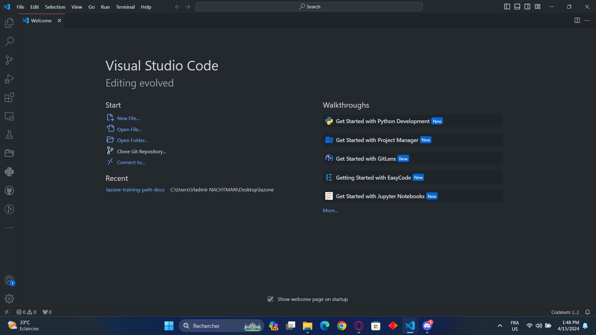

Puis copier le lien du Repo depuis le github du projet pour le renseigner au niveau de `VS-code` :

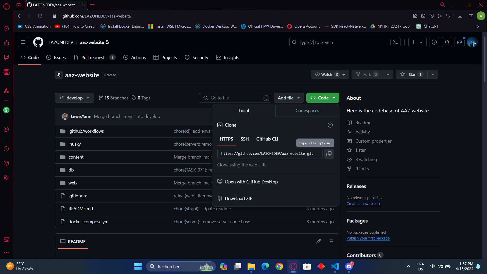

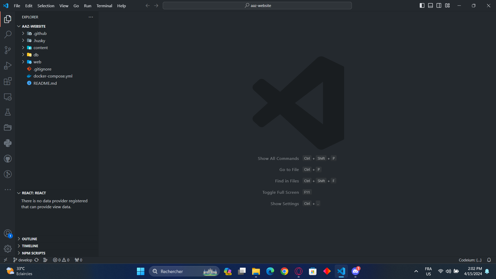

Une fois que cette étape est faite alors vous aurez à selectionner l'emplacement du projet puis le projet sera correctement cloner sur votre ordinateur.

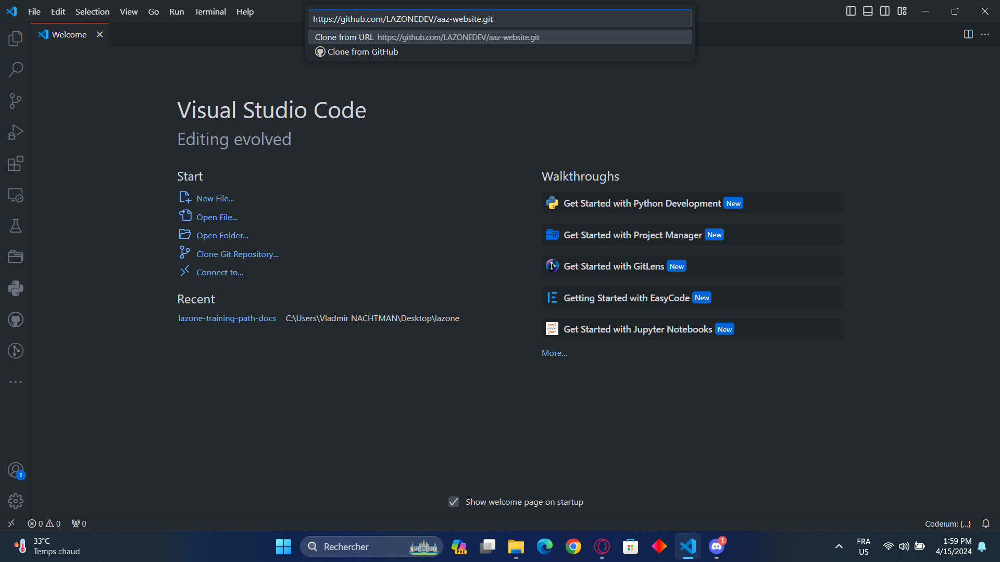

## Etape 2: Suivre le README du projet

Dans chaque projet de lazone, nous disposons d'un fichier titré `README.md` qui comporte les instructions de bases pour démarrer le projet dont il est question.

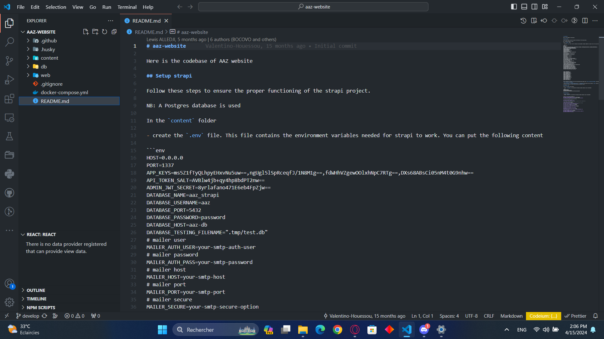

### Phase 1: Création d'un fichier .env dans le dossier content

Le dossier `content` represente ici le backend du projet qui est ecrit en `strapi`. Une fois le fichier `.env` créé, il faut insérer des lignes d'instructions laissées dans le readme. Ces lignes d'instructions représente des variables environnementales qui ne sont pas toujours à jour dans le readMe donc n'hésitez pas a demander de l'aide aux devs de lazone à ce propos.

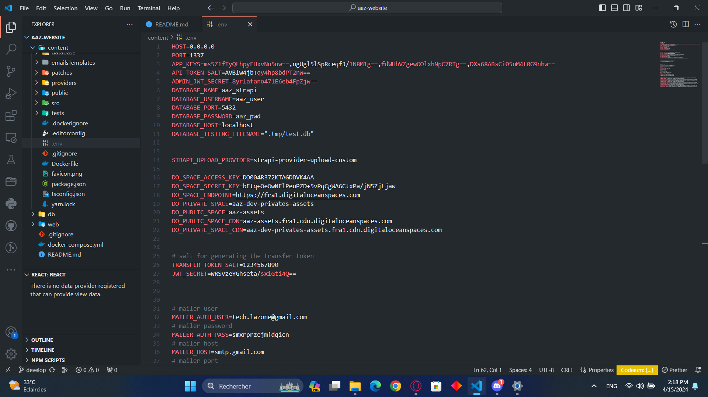

### Phase 2: Création d'un fichier .env.database dans le dossier db

Le dossier `db` représente la base de données du projet. Le fichier `.env.database` contient les variables d'environnement de la base de données.

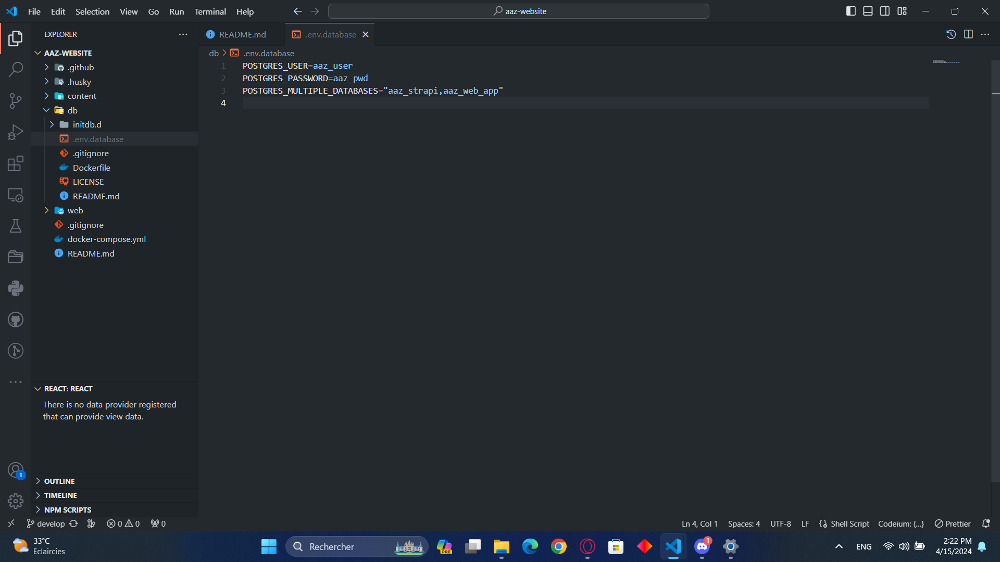

### Phase 3: Création d'un fichier .env.local dans le dossier web

Le dossier `web` représente le frontend du projet et donc `.env.local` sont les variables d'environnement du frontend.

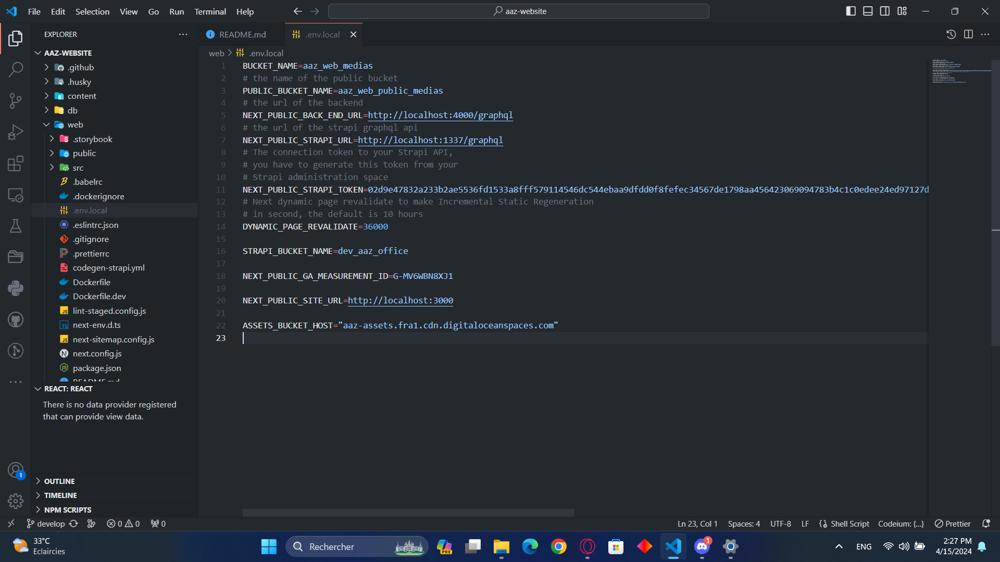

### Phase 4: Dockerizer la base de donnée à l'aide de docker

Avant toute autre manipulation, ouvrir le fichier `docker-compose.yml` qui se trouve à la racine du projet. Il nous permettra de déterminer comment sont répartir les services et les noms qui sont attribués à chaque service. Nous allons ici utiliser le nom destiné au service de la base de données qui se termine généralement par db.

Dans ce projet, le service en charge de la base de données est `aaz-db`.

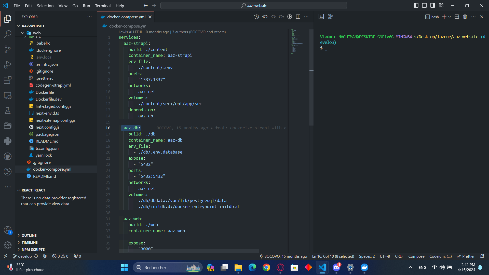

**NB**: Un service dans le `docker-compose.yml` représente soit le frontend, le backend ou la db. Donc un service est attribué pour chacune de ces parties du projet.

- Ouvrir dans `VS-code` un terminal (Git bash est très recommandé);
- Lancer la commande `docker compose up aaz-db`.

### Phase 5 : Installer les dépendences du frontend **web** et du backend **content**

Pour ce faire :

**Frontend**

- Ouvrir dans `VS-code` un terminal (Git bash est très recommandé);
- Utiliser le terminal pour se déplacer depuis la racine du projet vers le répertoire **web**;
- Lancer la commande `yarn` ou `yarn install`;
- Attendre ensuite la fin du téléchargement et de l'installation des dépendances.

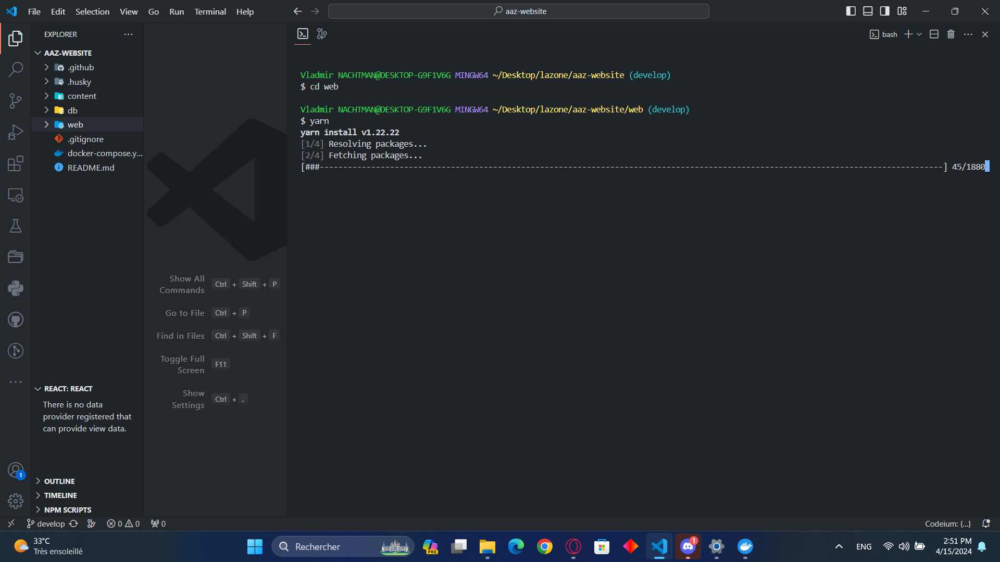

**Backend**

- Ouvrir dans `VS-code` un terminal (Git bash est très recommandé);
- Utiliser le terminal pour se déplacer depuis la racine du projet vers le répertoire **content**;
- Lancer la commande `yarn` ou `yarn install`;
- Attendre ensuite la fin du téléchargement et de l'installation des dépendances.

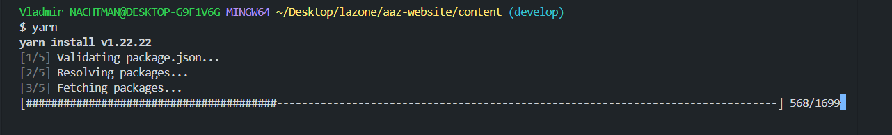

**Remarque**: Il se peut que vous ayez l'erreur suivant en voulant installer les dependances que ce soit au niveau du frontend ou du backend.

`error content@0.1.0: The engine "node" is incompatible with this module. Expected version ">=14.19.1 <=18.x.x". Got "21.7.2"`  
`error Found incompatible module.`

Dans ces cas, veuillez procéder comme sur l'image suivant :

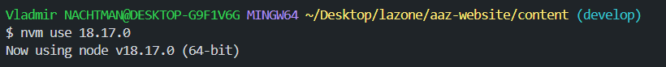

ou même l'erreur

`bash: /c/Program Files/nodejs/yarn: No such file or directory`

Applique alors la solution ci-dessus :

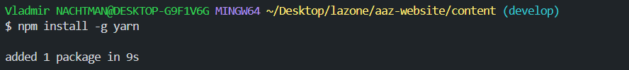

## Etape 3 : Mettre à jour la base de données à travers le service dockerisé **aaz-db**

Il se peut après la dockerisation de la db vous ayez l'erreur sur l'image suivante :

Dans ce cas procéder de la façon suivant pour créer la base de données au niveau de conteneur Docker de postgres :

- Ouvrir l'invite de commande;
- Vérifier que votre conteneur est en cours avec la commande `docker ps`;

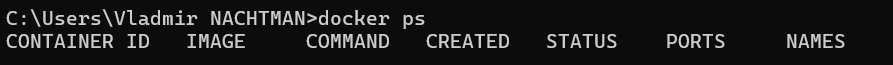

Si vous obtenez ce résultat, cela voudrait dire que votre conteneur n'est pas en cours c'est-à-dire que votre base de données n'est pas en cours de fonctionnement. Pour lancer le conteneur :

- Ouvrir Docker Desktop;
- Démarrer le conteneur de la façon suivante :

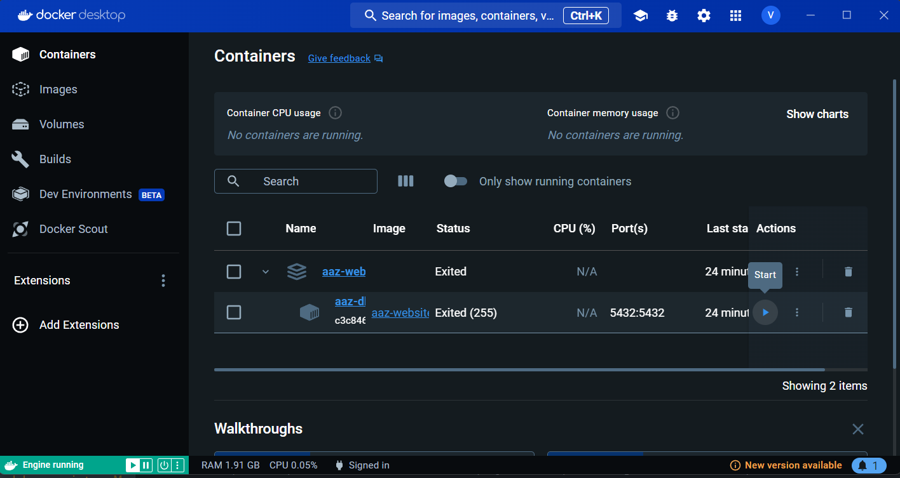

- Une fois le conteneur en cours, cliquer sur le name du conteneur puis aller dans l'onglet `Exec`:

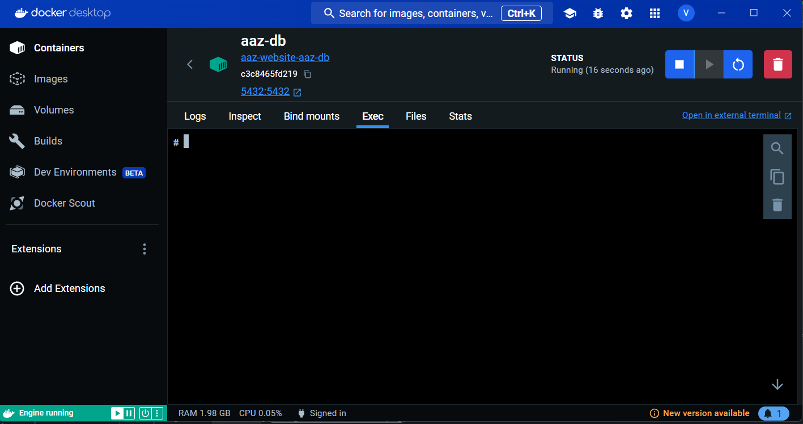

- Puis exécuter le script suivant

  `psql -v ON_ERROR_STOP=1 --username "$POSTGRES_USER" <<-EOSQL
CREATE DATABASE $database;
EOSQL`

**NB**: Prennez soin de remplacer "$POSTGRES_USER" et $database respectivement par le nom d'utilisateur de la db et le nom de la db qui se trouve dans le fichier `.env.database` dans le dossier `db` .

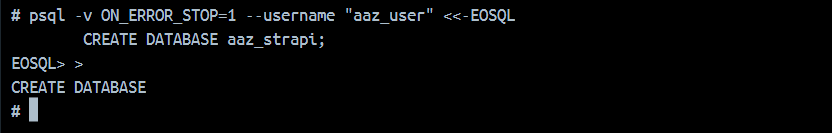

**Par ailleurs, si vous avez eu aucune erreur après dockerisation de la base de données, veuillez poursuivre la documentation.**

En effet, la dockerisation de la base de donnée nous renvoie une base de donnée vide. Il nous faut donc charger un `dumpfile` dans le service aaz-db pour recupérer les dernières données du projet. Ce dumpfile est généralement fourni par les devs de lazone en cas de besoins. Une fois le dumpfile acquis, suivre la procédure suivante:

- Télécharger le dumpfile le plus récent de la base de donnée du projet;
- Ouvrir l'invite de commande, puis se diriger vers le repertoire comportant le dumpfile;
- Exécuter la commande `docker cp <DUMP_FILE> <ID_DU_CONTENEUR>:docker-entrypoint-initdb.d` :

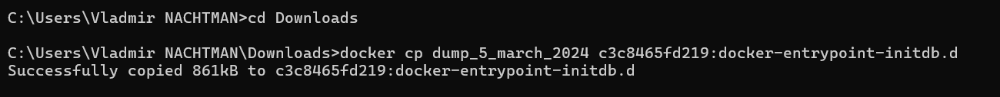

- Exécuter ensuite la commande `docker exec -it <ID_DU_CONTENEUR> bash` :

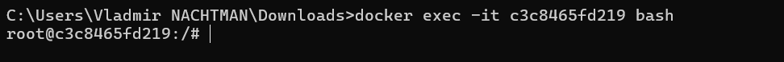

- Suiver ensuite les étapes ci-dessous pour aller dans le répertoire qui comporte le dumpfile et l'importer:

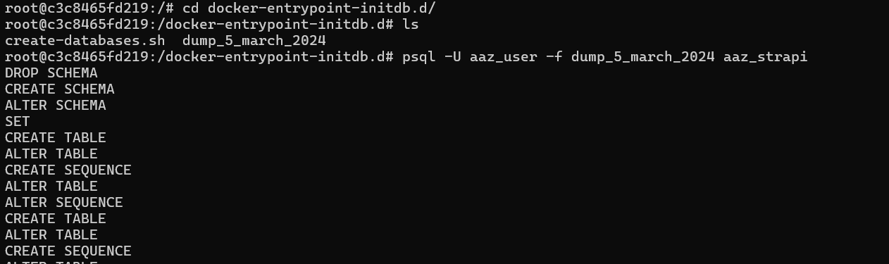

Enfin, attender la fin du processus pour continuer la documentation.

#### A noter:

Il est souvent fréquent dans les projets de lazone, plus précisement dans le backend d'utiliser des plugins. Il est donc necessaire d'installer les dépendences du plugins avant de pouvoir lancer le backend. Pour vérifier l'existence d'un plugin, suivez le chemin `content/src/plugins`. Si le dossier plugins n'existe pas ou est vide alors cela veut signifier qu'il y a pas de plugin utiliser pour ce projet. Par contre s'il n'est pas vide, alors **Ouvrir un terminal bash dans ce répertoire et lancer la commande** `yarn` ou `yarn install`

## Etape 4 : Lancer le projet et Vérifier le rendu

Le lancement du projet en local requiert ainsi le lancement de trois differents services :

- Le Frontend;-
- Le Backend;
- Et enfin la Db sur docker.

### Phase 1 : Lancement du backend

Pour réaliser cette phase, il faut :

- Ouvrir dans `VS-code` un terminal (Git bash est très recommandé);
- Utiliser le terminal pour se déplacer depuis la racine du projet vers le répertoire **content**;
- Lancer la commande `yarn develop`;

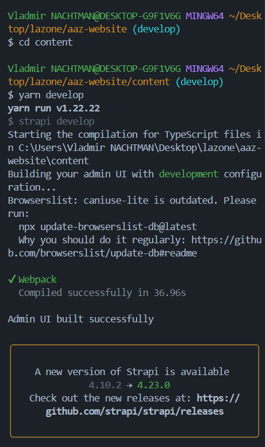

### Phase 2 : Lancement du frontend

Pour réaliser cette étape, il faut :

- Ouvrir dans `VS-code` un terminal (Git bash est très recommandé);
- Utiliser le terminal pour se déplacer depuis la racine du projet vers le répertoire **web**;
- Lancer la commande `yarn dev`;

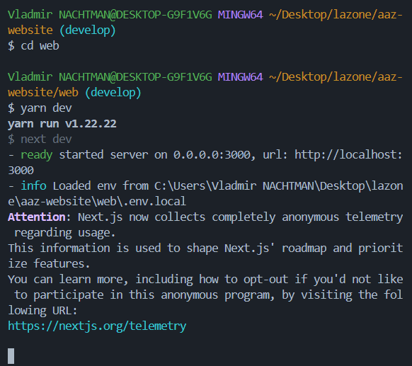

### Phase 3 : Lancement de la Db sur docker

Pour ce faire :

- Ouvrir dans `VS-code` un terminal (Git bash est très recommandé);
- Lancer la commande `docker compose up aaz-db`;
